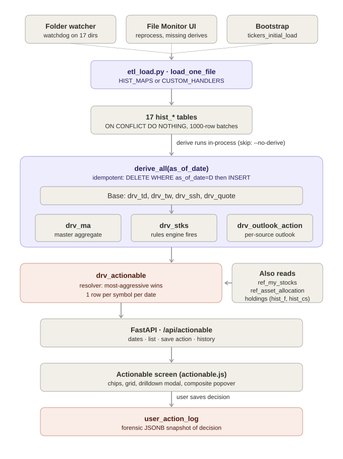
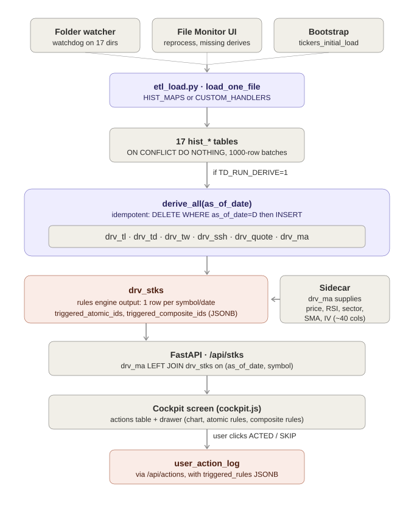
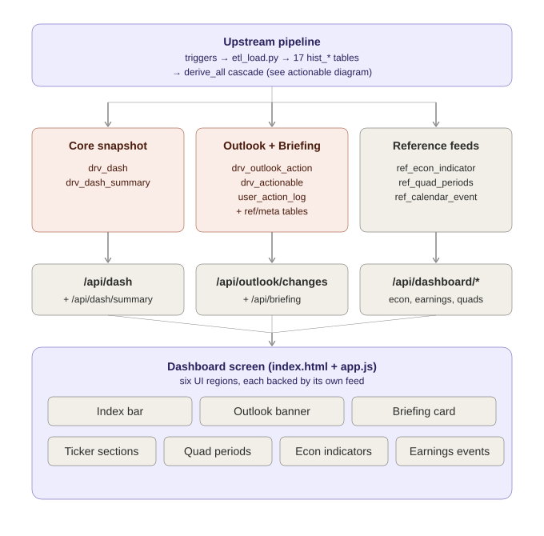
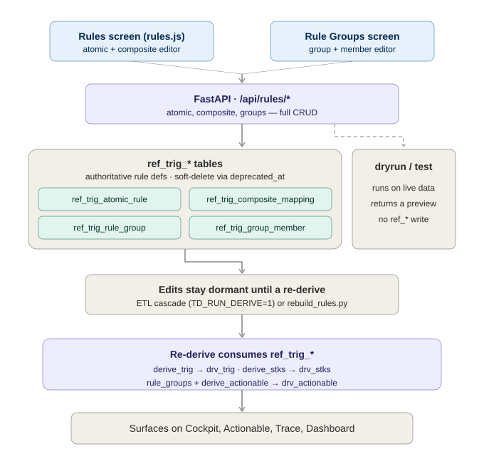
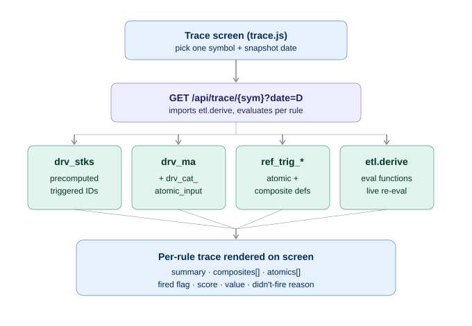
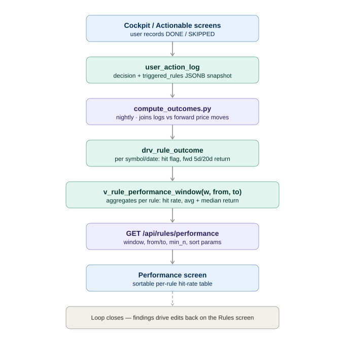

# Trading Dashboard — Screen & Data-Flow Reference

*Generated 2026-05-20. A consolidated reference covering the application screens, how
data flows from source files through the derive pipeline to each screen, the rules
engine, and the column-level lineage between derived and history tables.*

**Companion files in this folder**

- `diagrams/` — the six data-flow diagrams (`.svg`) referenced in section 3
- `drv_column_lineage_mapping.xlsx` — the full column-level `hist_*` → `drv_*` mapping (475 columns)

**Contents**

1. Screen overview — Dashboard, Cockpit, Actionable
2. The Actionable screen — code walkthrough
3. Data-flow diagrams
4. The rules-engine screens — Rules, Rule Groups, Trace, Performance
5. Derived-table column lineage

---

## 1. Screen overview

The app has three primary decision screens. They look similar but sit at different
depths of the pipeline.

### Dashboard (`/`, `index.html` + `app.js`)

The market-overview screen. Pulls `/api/dash` (→ `v_dash(D)` → `drv_dash`) for the
as-of date, plus side feeds for the index bar, outlook banner, briefing card, ticker
sections grid, quad periods, economic indicators, and upcoming earnings. Broad,
snapshot-level context — "what does the world look like today" — not symbol-specific
actions.

### Cockpit (`/cockpit`, `cockpit.html` + `cockpit.js`)

The per-symbol decision drilldown. Pulls `/api/stks` (→ `v_stks(D)` → `drv_stks`, up
to 5000 rows) and renders an actions table filterable by action code, sector, and
symbol search. Clicking a row opens a drawer with a Chart.js price chart plus the
**triggered atomic rules** and **triggered composite rules** that fired for that
symbol. Posts user decisions to `/api/actions`. "Open the cockpit on one ticker and
see exactly why a rule fired."

### Actionable (`/actionable`, `actionable.html` + `actionable.js`)

The consolidated actions queue. Pulls `/api/actionable` (→ `drv_actionable.consolidated_action`,
the rule-group-resolved next step per symbol after position-rule suppression). UI is
summary chips by category (remove / reduce / increase / add / hold), plus toggles for
"current positions only", "show acted/snoozed", "show suppressed". The modal shows the
final decision, per-source actions (F/CS split), and the rules-engine fires. "My work
queue — what the engine says I should *do* today."

### How they differ

| | Backing data | Granularity | Purpose |
|---|---|---|---|
| Dashboard | `drv_dash` + index/econ/earnings feeds | Market-wide snapshot | Situational context |
| Cockpit | `drv_stks` (all rule fires per symbol) | Per-symbol raw rule output | Investigate / diagnose |
| Actionable | `drv_actionable` (consolidated, rule-group-resolved) | Per-symbol resolved decision | Execute / decide |

Cockpit shows the *raw* rule-engine fires per symbol; Actionable shows the
*consolidated* decision after rule-groups and position-rule suppression filter that
noise into one recommended action. Dashboard sits above both — market overview, not the
action layer.

---

## 2. The Actionable screen — code walkthrough

### Where it lives

- `web/actionable.html` — page shell + all CSS inline
- `web/actionable.js` — client logic (state, filters, render, drilldown, action save)
- `api/routers/dash.py` — four endpoints: `/api/actionable/dates`, `/api/actionable`,
  `/api/actionable/{symbol}/action` (POST), `/api/actionable/history`
- Backing table `drv_actionable` (one row per symbol per snapshot date), populated by
  `etl/derive_actionable.py`
- Companion table `user_action_log` — every recorded decision, with a forensic JSONB snapshot

### Frontend state model

A single `state` object holds `date`, `allRows` (everything fetched for the date),
`rows` (filtered subset shown), a `filters` block (`action`, `category`, `held_only`,
`show_acted`, `show_suppressed`), and `current` (the row the modal is open on). One
deliberate choice: the action-chip filter and category filter are applied
**client-side** (`applyClientFilter`), while `show_acted` / `show_suppressed`
round-trip the server. The reason is in the comment at line 71 — *"Always fetch all
rows so chip counts stay accurate."* If chip counts were computed off a filtered server
response, clicking REMOVE would shrink the other chips to zero.

### Load flow

1. `loadDates()` calls `/api/actionable/dates` → distinct `as_of_date` from
   `drv_actionable`, newest first → populates `#datePicker`, picks the most recent,
   calls `loadActionable()`.
2. `loadActionable()` builds query params (only `show_acted` / `show_suppressed` go
   server-side) and calls `/api/actionable?date=…`. Rows come back already sorted by
   `consolidated_action` severity (REMOVE=4 → HOLD=0) then `winning_priority`.
3. `applyClientFilter()` filters by `action`, `category`, `held_today`, then triggers
   `renderSummary()`, `renderCategoryFilter()`, `renderGrid()`.

### The five chips

`REMOVE / REDUCE / INCREASE / ADD / HOLD` plus an `ALL` chip. Counts come from
`state.allRows` (not the filtered set), so they stay stable as you click between them.
Click toggles the action filter on/off.

### The grid

Columns: Action badge · Outlook chip (today / was) · Symbol + description · Category ·
Sector · Pos $ · Min · Max · Units · **Suggested $** · Source · Pri · Tags. Tag pills:
`★ MY` (`in_my_list`), `RULE×N` (count of `rules_engine_fires`), `SUPPRESSED` (with
reason), `ACTED` (last user action). Clicking a row opens the drilldown.

### Outlook rendering — worth flagging

`_weightToOutlook(w)` infers an outlook label + "Bench" modifier from a numeric weight
via magnitude thresholds (`>2` → BULLISH, `0.5..2` → BULLISH Bench, `±0.5` → NEUTRAL,
etc.). The "Bench" detection is purely inferred from fractional magnitude. This is
fragile — if the scoring scale ever changes, this UI lies silently with no error.
Worth a comment near the rule noting the UI assumes the ±3 / ÷3 convention.

### Drilldown modal

`openDrilldown(row)` populates the decision block (`#modalKv`), renders **Per-source
actions** from the `source_actions` JSONB (one row per outlook source with base/prev
weight, delta, today/was outlook, held, action, reason), renders **Rules engine fires**
as clickable composite-code pills from `rules_engine_fires` JSONB, wires the
user-action form (DONE / SKIPPED / SNOOZED / OVERRIDDEN + override target + snooze date
+ notes), and calls `loadHistory(symbol)`.

### Composite → atomic popover

Clicking a composite-rule pill calls `openAtomicPopover()`, which fetches
`/api/trace/{symbol}?date={asOf}` (cached in a `traceCache` Map keyed by `symbol@date`),
filters the trace's `atomics` array to those whose `rolls_into` includes the clicked
composite code, sorts fired-first then by `|weight|` desc, and renders a sub-table of
each atomic's value, breakout range, weight, and fired flag. It reuses the Trace
endpoint rather than introducing its own.

### Saving a decision — the forensic snapshot

`saveUserAction()` POSTs `{as_of_date, user_action, user_action_target, snooze_until,
user_notes}` to `/api/actionable/{symbol}/action`. The API does something easy to miss:
it **forensically snapshots** the moment of decision into `user_action_log` — it
re-reads the `drv_actionable` row, queries `ref_outlook_source`, pulls the latest
`hist_*` row from each source ≤ as_of_date (sanitizing non-JSON values to strings), and
stores the whole bundle in `source_raw_snapshot` JSONB alongside `source_actions`,
`rules_engine_fires`, and every key numeric field. Even if rules change later, you can
replay exactly what you saw when you said DONE. `dismissUserAction()` is a shortcut
that POSTs `user_action: 'SKIPPED'` with no snooze.

### Server-side filter coupling

The `show_acted` toggle is enforced in **two** places: the SQL excludes
`suppressed_reason IS NOT NULL` rows when `show_suppressed=False`, and a Python
post-filter loop excludes rows whose last user action was DONE/SKIPPED/OVERRIDDEN or
whose snooze hasn't expired. If anyone adds a new "acted" verb, they must update the
Python tuple as well as the SQL.

---

## 3. Data-flow diagrams

Six diagrams trace how data reaches each screen. Each `.svg` is in the `diagrams/`
subfolder and can be opened directly in a browser.

### 3.1 Actionable screen

Three trigger sources funnel into one loader. The folder watcher (`etl/scheduler.py`,
a watchdog Observer with a debounce) is the steady-state path; the File Monitor UI's
"Reprocess" / "Run Missing Derives" buttons are the manual paths; `tickers_initial_load`
is the one-time bootstrap. All three call `etl_load.py::load_one_file`, which dispatches
by file type to a `HIST_MAPS` entry or a `CUSTOM_HANDLERS` callable, inserting into one
of the 17 `hist_*` tables with `ON CONFLICT DO NOTHING`, committing per 1000-row batch.

After the load, `derive_all(file_dt)` runs inline — skip it with `--no-derive` for
bulk loads. A file landing on an old snapshot date also triggers a forward re-derive
of every later date it invalidated. Inside the cascade every step is idempotent (`DELETE WHERE as_of_date=D` then
`INSERT`). `drv_actionable` is the resolver: it reads `drv_outlook_action`, `drv_stks`,
`ref_my_stocks` + `ref_asset_allocation`, and live holdings from `hist_f` + `hist_cs`,
picks the most-aggressive action across sources, applies position-rule suppression, and
writes one row per symbol. From there it is plain read paths to the screen, and the
Save button writes a forensic snapshot into `user_action_log`.

### 3.2 Cockpit screen

Same upstream pipeline as Actionable — same triggers, loader, `hist_*`, gated
`derive_all`. The divergence is *where you stop reading*: Cockpit consumes `drv_stks`
directly (the rules engine's raw per-symbol output), while Actionable consumes
`drv_actionable` (the resolved decision). `/api/stks` does a `LEFT JOIN drv_ma +
drv_stks` so the table can show price/sector/RSI/SMA/IV alongside the rules-engine
columns. The drawer renders triggered rules straight from the `triggered_atomic_ids` /
`triggered_composite_ids` JSONB columns — no extra fetch. The POST to `/api/actions`
writes to the same `user_action_log` table as Actionable.

### 3.3 Dashboard screen

Unlike the other two (each reads essentially one table), the Dashboard is a **fan-in**
of seven feeds. `app.js` issues a separate fetch per section: `/api/dash` +
`/api/dash/summary` for the ticker grid and index bar; `/api/outlook/changes` for the
outlook banner; `/api/briefing` (itself a four-way internal fan-in over
`user_action_log`, `drv_rule_outcome`, `v_outlook_changes`, `drv_actionable`,
`ref_asset_allocation`, `meta_etl_run`); and `/api/dashboard/{econ-indicators,
earnings,quads}` for the reference panels. The Dashboard is mostly read-only — no
user-decision capture — and is the only screen that depends on SQL *functions*
(`v_dash`, `v_dash_summary`, `v_outlook_changes`) rather than querying derived tables
directly.

### 3.4 Rules + Rule Groups authoring

`rules.js` and `groups.html` are CRUD front-ends over the rules engine's `ref_trig_*`
definition tables. Deletes are *soft* (`deprecated_at = now()`). Two takeaways: the
**dryrun / test** branch evaluates a rule against live data and returns a preview —
it never writes `ref_trig_*`; and the **gate** — a CRUD edit only changes the
`ref_trig_*` table, it does not touch `drv_trig` / `drv_stks` / `drv_actionable` until
a re-derive runs (the ETL cascade on the next load, or a manual
`rebuild_rules.py`). Until then the other screens still reflect the old rules. This is
the most common "I edited a rule and nothing changed" gotcha.

### 3.5 Trace screen

Trace is the engine's debugger. `/api/trace/{sym}` does not just SELECT — it imports
`etl.derive` and re-runs the actual evaluators (`eval_atomic_rule`,
`_eval_precondition`). It pulls four things together for one (symbol, date): the
precomputed scores from `drv_stks` (the `triggered_*_ids` JSONB), the indicator values
the rules tested from `drv_ma` + `drv_cat_atomic_input`, the rule definitions from
`ref_trig_*`, and the live evaluators. It assembles a per-rule trace with every
atomic/composite's fired flag, score, tested value, and didn't-fire reason. This is
also the endpoint the Cockpit and Actionable composite popovers call.

### 3.6 Performance screen — the feedback loop

Performance is purely an *output* — no editing, just a sortable table — but it sits at
the end of the longest chain. Every decision recorded on Cockpit or Actionable lands in
`user_action_log` with a snapshot of which rules were triggering. Nightly,
`compute_outcomes.py` joins those decisions against subsequent price moves (forward 5d
/ 20d returns) and writes `drv_rule_outcome`. `v_rule_performance_window` aggregates
that per rule into a hit rate and average/median forward return, exposed via
`/api/rules/performance`. The findings send you back to the Rules screen to deprecate
losers and tune winners — closing the loop.

The four rules screens form one cycle: **author** (Rules, Rule Groups) → **act**
(Cockpit, Actionable) → **measure** (Performance) → back to author, with **Trace** as
the inspection tool at any point.

---

## 4. The rules-engine screens

Four screens drive the rules engine. They split into two roles: **authoring** (Rules,
Rule Groups write rule definitions) and **observability** (Trace, Performance read what
the engine did).

### Rules (`/rules`, `rules.html` + `rules.js`)

A CRUD editor for atomic rules (`ref_trig_atomic_rule` — single-condition predicates)
and composite rules (`ref_trig_composite_mapping` — boolean expressions over atomics).
Endpoints: `/api/rules/atomic` and `/api/rules/composite` (GET list, GET one, POST,
PUT, DELETE), plus `/api/rules/composite/{id}/atomics`, `PUT …/members`, and dryrun
endpoints. Deletes are soft (`deprecated_at`). The composite "members" PUT does a
`DELETE FROM ref_trig_composite_mapping` then re-INSERT.

### Rule Groups (`/groups`, `groups.html`)

A CRUD editor for rule groups (`ref_trig_rule_group`) and their members
(`ref_trig_group_member`). Endpoints: `/api/rules/groups` (GET, POST, PUT, DELETE) plus
`/api/rules/groups/{code}/test`. Rule groups bundle composites into actionable groups
with preconditions; the winning group per symbol drives
`drv_actionable.consolidated_action`.

Edits on either screen only change the `ref_trig_*` tables — they do not propagate to
the dashboard until a re-derive (`rebuild_rules.py` or the ETL cascade). The dryrun /
test endpoints preview a rule's effect without committing.

### Trace (`/trace`, `trace.html` + `trace.js`)

Read-only per-symbol diagnostic. `/api/trace/{sym}?date=D` re-evaluates every atomic
and composite rule for one (symbol, date) and returns a structured trace: `summary`,
`composites[]`, `atomics[]` — each with fired flag, score, tested value, breakout
range, and a didn't-fire reason. Preferred scores come from `drv_stks`; the live
re-evaluation via `etl.derive` is the fallback.

### Performance (`/rule-performance`, `rule_performance.html` + `rule_performance.js`)

Read-only analytics. `/api/rules/performance` calls
`v_rule_performance_window(window, from, to)` — per-rule hit rate, average and median
forward 5d/20d return, sample size — with a configurable rolling window and `min_n`
sample-size filter. It is the output end of the feedback loop fed by
`compute_outcomes.py`.

---

## 5. Derived-table column lineage

The full column-level mapping is in `drv_column_lineage_mapping.xlsx` — one row per
column of every `drv_*` table (475 columns across 17 tables), each traced to its
immediate source table, source column, and SQL transform. The workbook has three
sheets: **Overview** (table index + caveats), **Column Mapping** (the filterable master
matrix), and **Table Dependencies** (per-table source summary).

### Pipeline tiers

- **Tier 1** — `drv_quote`, `drv_td`, `drv_tw`, `drv_to`, `drv_sss`, `drv_rr`, `drv_y` —
  read raw `hist_*` directly. `drv_quote` is a latest-loaded-wins merge across `hist_y` /
  `hist_tl` / `hist_td`. (`drv_tl` retired 2026-05-20; `drv_ssh` retired earlier.)
- **Tier 2** — the 5 component tables `drv_symbols`, `drv_technicals`, `drv_fundamentals`,
  `drv_outlooks`, `drv_portfolio` (joined + latest `hist_*` rows). **`drv_ma` is a VIEW**
  over these five (as of 2026-05-31) — query it freely, never INSERT into it.
- **Tier 3** — `drv_cat_atomic_input`, `drv_dash`, `drv_stks` — built on the `drv_ma` VIEW.
- **Tier 4** — `drv_trig`, `drv_dash_summary`, `drv_missing_symbols`,
  `drv_outlook_action`.
- **Tier 5** — `drv_actionable` — the consolidated per-symbol decision.
- **Independent** — `drv_realized_gain`, `drv_cs_realized_gain` (FIFO P&L),
  `drv_rule_outcome` (the feedback-loop scoring table).

In the workbook `source_table` is the *immediate* source — for tables above Tier 1 it
may be another `drv_*` table. Trace transitively up the tiers for the full `hist_*`
origin (e.g. `drv_dash` ← `drv_ma` ← `hist_*`).

### Key findings from the lineage trace

- **`drv_ma` is now a VIEW (2026-05-31)** — the former wide ~98-column materialized
  table (of which ~42 columns sat permanently NULL) was replaced by a JOIN VIEW over the
  5 component tables. The dead-column problem is therefore obsolete: each component table
  declares only the columns it actually populates. Live rule-input columns live in
  `drv_cat_atomic_input`.
- **`drv_cat_atomic_input` (143 columns) is registry-driven** — built by
  `_derive_cat_table_impl` from an `INSERT…SELECT` that `ma_codegen.py` generates from
  the `ref_ma_columns` database table. The exact per-column SQL (`source_expr`) lives
  in the database, not in repo files; the workbook's transform column shows the Excel
  array/cell formula from `docs/ma_columns_v2.csv`, the checked-in source of record.
- **`drv_ma.sector` is fed from `ref_sector.equity_sector`** (not `ref_sector.sector`)
  — the SELECT lists `rs.equity_sector` into both the `sector` and `equity_sector`
  slots. A naming quirk, not a bug to "fix" blindly.
- **`drv_dash_summary.n_below_trend`** compares `last_price < a_trade_value` (not
  `a_trend_value`) — flagged during extraction; confirm intent before relying on it.
- **`drv_quote`** merges `hist_y` / `hist_tl` / `hist_td` latest-loaded-wins per field;
  note `hist_y` stores net change as `change_amt` while `tl`/`td` use `net_chng`, and
  `hist_y` carries no `rsi` / `imp_volatility`.

### Open item

The exact SQL `source_expr` for `drv_cat_atomic_input`'s registry columns could not be
resolved from repo files alone — it lives in the `ref_ma_columns` database table. A
dump of that table would let the workbook show the precise SQL for those 143 columns.

---

*End of reference. See `drv_column_lineage_mapping.xlsx` for the full column matrix and
the `diagrams/` folder for the source `.svg` files.*
