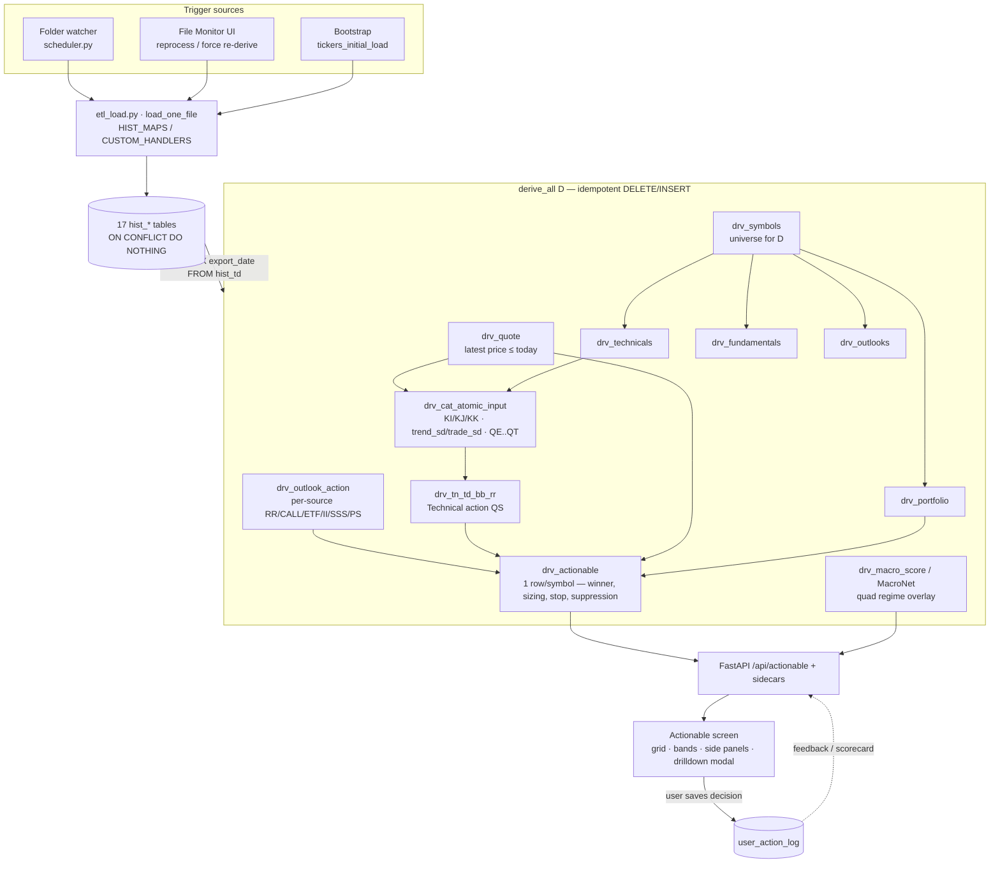
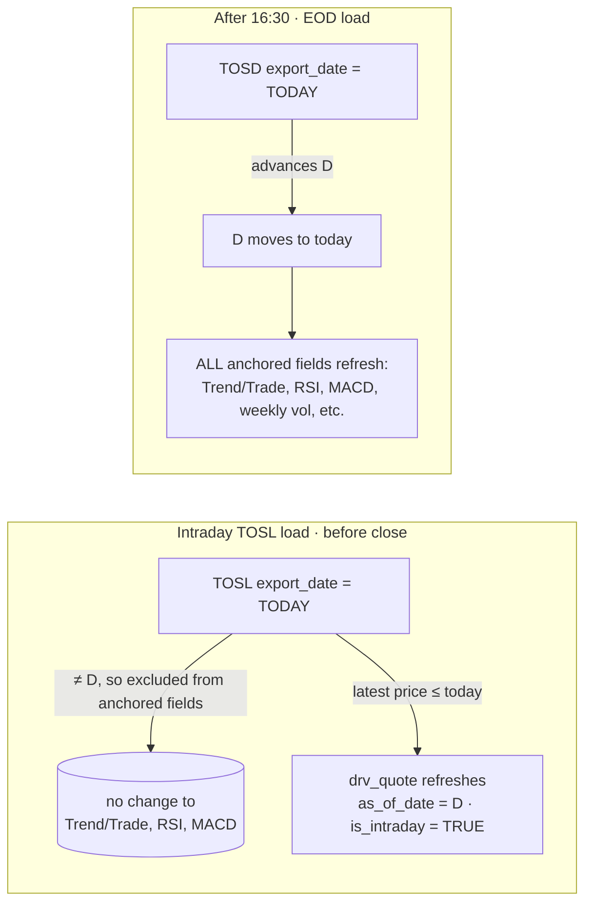
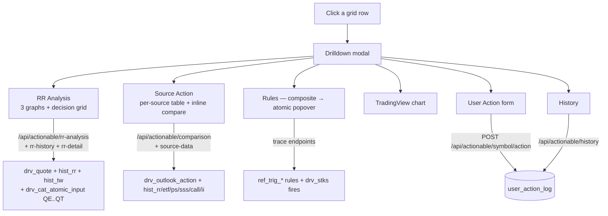

# Actionable Screen — Full Data-Flow Analysis

What feeds every element of the Actionable screen, and **what actually changes
when you load an intraday TOSL** vs. what waits for the EOD close. Written for
fast short-term decision-making: know which numbers in front of you are *live*
right now and which are stale until the market closes.

Grounded in `api/routers/dash.py::get_actionable`, `docs/derive_date_logic.md`,
`docs/actionable_logic.md`, and `web/actionable.html`.

---

## TL;DR — your intraday TOSL load

You loaded **TOSL intraday** (before today's close). Under the anchor model
(`docs/derive_date_logic.md`):

- The derive date **`D = MAX(export_date) FROM hist_td` (TOSD)**. An intraday
  TOSL does **not** advance `D` — only the EOD TOSD does. So `D` is still the
  **previous completed session**.
- The load **did** run the full `derive_all(D)` cascade (every load re-derives
  the current anchor), and it **did** refresh `drv_quote` with your fresh
  intraday price (tagged `as_of_date = D`, `is_intraday = TRUE`).
- Therefore **only the price-driven cells refresh now**; the EOD-anchored
  fields (Trend/Trade lines, RSI/MACD, weekly volume, outlook Sources, the
  model, macro) stay at the prior close until you load **TOSD/TOSL/TOSW EOD**
  after 16:30.

> **Money takeaway:** intraday, trust the **price-relative** signals (Risk-Range
> position, Trend/Trade SD, %CHG, AMT$, stop level, and the Technical action
> that those drive). Treat the **Sources** column, **P(↑20d)**, **MACRO**, and
> the **side panels** as "as of last close" — they won't move until the EOD
> files land.

The "Did it refresh?" checklist and the SQL to prove it are in
`agent-tasks/TASK_92_verify_actionable_refresh.md`.

---

## 1. End-to-end pipeline

The 17 source feeds land in `hist_*`, then a single gated cascade derives the
anchor date. `drv_actionable` is the resolved one-row-per-symbol decision; the
API joins it to the technical, quote, volume, and macro tables; the screen
renders columns, bands, side panels, and the drilldown.

---

## 2. Anchor model — why intraday ≠ EOD

| Rule | Sources | Behavior on your intraday load |
|---|---|---|
| **Anchor** `D = MAX(export_date) hist_td` | TOSD | **Unchanged** — no new TOSD, so `D` = last close |
| **Exact-match `export_date = D`** | TOSL, TOSW, Y (EOD) | Intraday TOSL has `export_date = today ≠ D` → **excluded** from anchored fields |
| **Latest price ≤ today** | TOSL / Y / TD → `drv_quote` | **Refreshes** — your intraday price flows in, tagged `as_of_date = D` |
| **Carry-forward ≤ D** | RR, CALL, ETF, II, SSS, PS, CS, F | **Unchanged** — periodic feeds, no new file |

---

## 3. Grid columns → data source → intraday refresh

`get_actionable` selects `drv_actionable.*` joined to `drv_tn_td_bb_rr`,
`drv_rr`, `drv_technicals`, `drv_outlooks`, `drv_quote`, `hist_y`,
`user_action_log`, holdings (`hist_f`/`hist_cs`), `drv_tw`, and the macro-score
table. Mapping each visible column:

| Column | Source field | Underlying feed | Refreshes intraday? |
|---|---|---|---|
| **POS$** (current position) | `drv_actionable.current_position_dollar` | CS/F positions (carry-forward) | ❌ until new position file |
| **AMT$** (delta to target) | `drv_actionable` target − position; price-clamped | quote + sizing | ⚠️ partial — moves with price-driven targets/stop |
| **%CHG** | `drv_quote.pct_change` | TOSL/Y intraday quote | ✅ **yes** |
| **Symbol** | `drv_actionable.tos_symbol` | universe (`drv_symbols`) | ❌ |
| **ACTION** (Final Call) | reconciled call + confidence | composite of below | ⚠️ shifts only as its price-driven inputs move |
| **MACRO** | `macro_score.macronet / macro_action` | FRED quad regime overlay | ❌ macro feed |
| **CALC** (Final Call cal) | `bull_prob` bands (sidecar endpoint) | calibrated model | ❌ model/EOD |
| **Sources** | `drv_actionable.consolidated_action` | RR/CALL/ETF/II/SSS/PS (periodic) | ❌ until those feeds load |
| **Technical** | `drv_tn_td_bb_rr.td_tn_bb_action_desc` | RR + quote-driven KI/KJ/KK + BB | ✅ **can change** — price-driven |
| **Vlm (RVOL)** | `drv_tw.w_vlm_expn_ratio / rvol` | TOSW weekly volume | ❌ weekly feed |
| **IV** | `drv_technicals.iv_percentile / hv` + `drv_quote.imp_volatility` | EOD technicals + quote | ⚠️ IV from quote may move; IVP/HV are EOD |
| **MACD / MACDH** | `drv_technicals.a_macd_brr / a_macdh_d_brr` | EOD TOSW technicals | ❌ EOD |
| **RSI** | `drv_technicals.rsi` | EOD technicals | ❌ EOD |
| **Rules (edge)** | `drv_actionable.triggered_group_ids` + scorecard | rules engine over derived inputs | ⚠️ only if a price-driven atomic flips |
| **P(↑20d)** | `bull_prob` (sidecar) | calibrated model | ❌ model/EOD |
| **Agree** | `agreement_class` | bull_prob vs action direction | ❌ |
| **Act** (inline buttons) | `user_action_log` | your decisions | live on click |

Legend: ✅ moves with your intraday price · ⚠️ moves only via its price-linked
inputs · ❌ flat until the relevant EOD/periodic file loads.

---

## 4. Drilldown modal → data source

- **RR Analysis** is the most intraday-live part: Graph 1 price bar, the
  TRR/MRR/LRR indices (KI/KJ/KK), and Trend SD / Trade SD all read
  `drv_quote` against EOD bands — they **move with your intraday price**. The
  Trend/Trade *lines themselves* (`a_trend_value`, `a_trade_value`) are EOD-fixed.
- **Source Action** table reflects the periodic outlook feeds — **flat
  intraday**.
- **Rules / atomic popover** can flip only if a price-driven atomic rule
  crosses its threshold.

---

## 5. Bands & side panels → data source

| UI element | Endpoint / source | Refreshes intraday? |
|---|---|---|
| **MACRO Regime Band** (top strip) | `macro_score` / MacroNet quad | ❌ macro feed |
| **Symbol Tape** (chip bar) | filtered grid rows | ✅ reflects grid |
| **Econ Panel** (FRED, lazy) | `/api/macro` (FRED) | ❌ until macro refresh |
| **Side: Macro Rail** | `/api/macro/areas` | ❌ macro feed |
| **Side: USD Correlations** | `derive_usd_correlation` (daily EOD `hist_y`) | ❌ EOD daily |
| **Side: Quad Outlook** | macro-score monthly/quarterly | ❌ macro feed |
| **Side: Econ Indicators** | FRED series | ❌ |
| **Side: Earnings / Events** | events feed | ❌ |
| **Stale banner / amber date** | `/api/anchor-status`, `/api/actionable/freshness` | ✅ request-time |

The entire right-hand side rail and the top macro band are **macro/periodic** —
none of them move on an intraday equity price load. That's expected; they frame
the regime you're trading *into*, not the tick-by-tick.

---

## 6. What to check on screen right now

1. **Hit Refresh.** The grid re-pulls `/api/actionable` for `D`.
2. **Date picker not amber.** Amber `.date-stale` = `/api/anchor-status` says
   data is behind the expected close. Intraday before close, amber is normal
   (you haven't loaded today's EOD yet).
3. **No orange "stale" banner.** `/api/actionable/freshness` flags
   `drv_actionable` as stale if newer source data loaded *after* the last
   derive. If it shows, click **Re-derive now**.
4. **Quote freshness.** Open any liquid name's drilldown — RR Analysis Graph 1
   right-edge price and %CHG should match the intraday tape. `quote_is_intraday`
   = TRUE confirms the live quote is in play.
5. **Don't expect** Trend/Trade lines, RSI, MACD, Sources, P(↑20d), MACRO, or
   the side panels to have moved — they're EOD/periodic.

The authoritative DB-level proof (the load actually wrote `drv_quote` for `D`
and the cascade re-ran) requires Postgres, which this session can't reach. That
verification is specced for the developer agent in
`agent-tasks/TASK_92_verify_actionable_refresh.md`.

---

## 7. Files referenced

| Concern | File |
|---|---|
| Anchor / per-source date rules | `docs/derive_date_logic.md`; `etl/derive.py::get_anchor_date` |
| Consolidation + sizing + suppression | `docs/actionable_logic.md`; `etl/derive_actionable.py` |
| Main grid query (column → table joins) | `api/routers/dash.py::get_actionable` (L388+) |
| Freshness check | `/api/actionable/freshness` → `etl/derive_freshness.py::find_stale_actionable_dates` |
| Stale/anchor warning | `/api/anchor-status`; `web/warning_badge.js` |
| Screen markup (columns, panels, modal) | `web/actionable.html`; `web/actionable.js` |
| Existing flow diagram | `docs/diagrams/1_actionable_data_flow.svg` |
