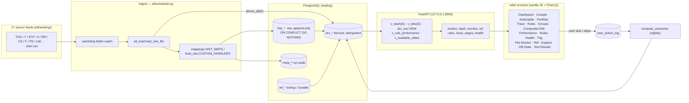
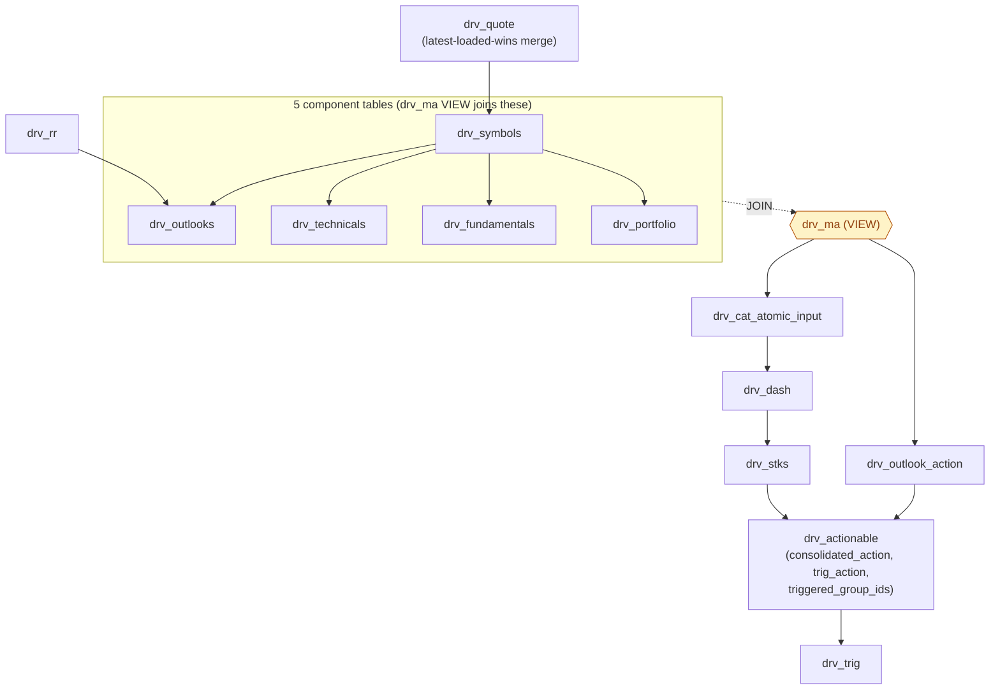
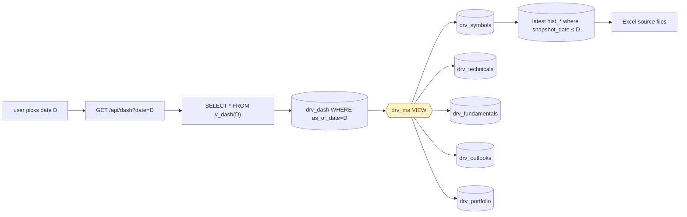
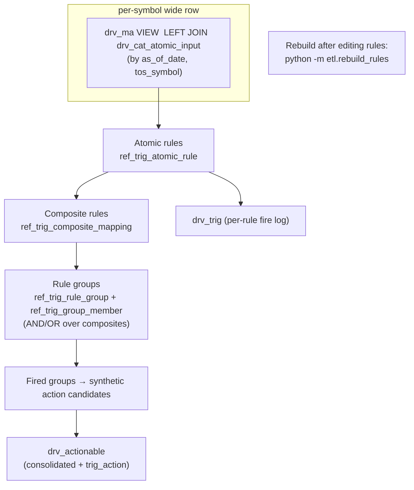
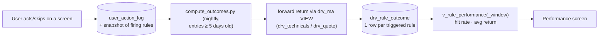

# Architecture & Data-Flow Diagrams

Easy-to-read Mermaid diagrams of the whole system. These render in GitHub, VS Code, and
most Markdown viewers. They complement the per-screen SVGs in `docs/diagrams/`.

Last verified against code: **2026-05-31** (post `drv_ma → VIEW` migration; post unused-code cleanup).

> Note: `v_dash(D)` and `v_stks(D)` are parameterised **functions** (not simple views) —
> they accept a date arg and return `SETOF drv_dash` / `SETOF drv_stks`.

---

## 1. End-to-end pipeline (source files → screens)

---

## 2. Derive cascade (what `derive_all(session, D)` runs, in order)

`drv_ma` is **not materialized** — it is a VIEW over the 5 component tables, so the cascade
populates those five, then everything downstream reads them through the VIEW.

> Each step is idempotent: `DELETE WHERE as_of_date=D` then `INSERT`. Re-running for date D
> is safe. `derive_v2.py` overrides v1 for **tw** and **sss** only — etf / ii / ps overrides
> were archived 2026-05-12; ssh was never implemented (drv_ssh retired).

---

## 3. Snapshot-date mental model (a read on the Dashboard)

---

## 4. Rules engine (three tiers → recommendation)

---

## 5. Feedback loop (action → outcome → performance)

