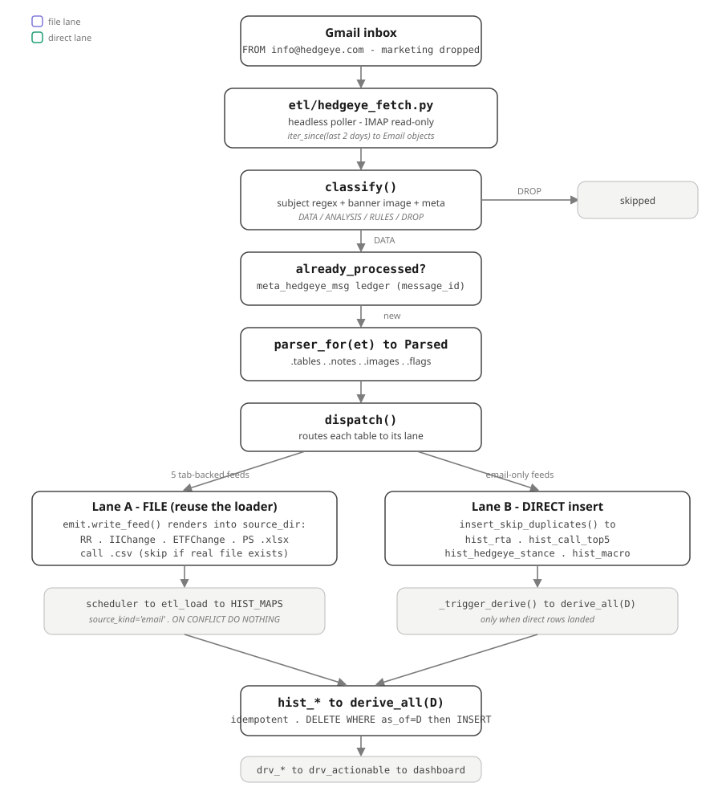
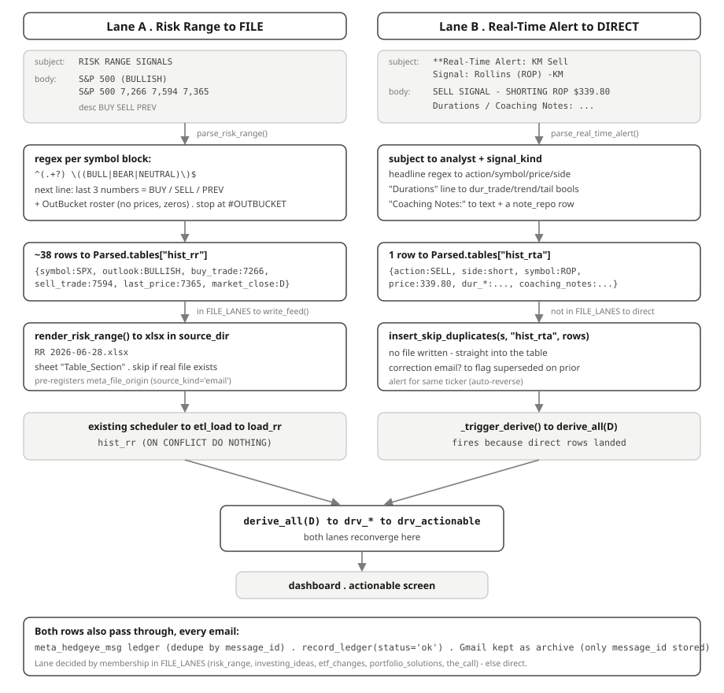
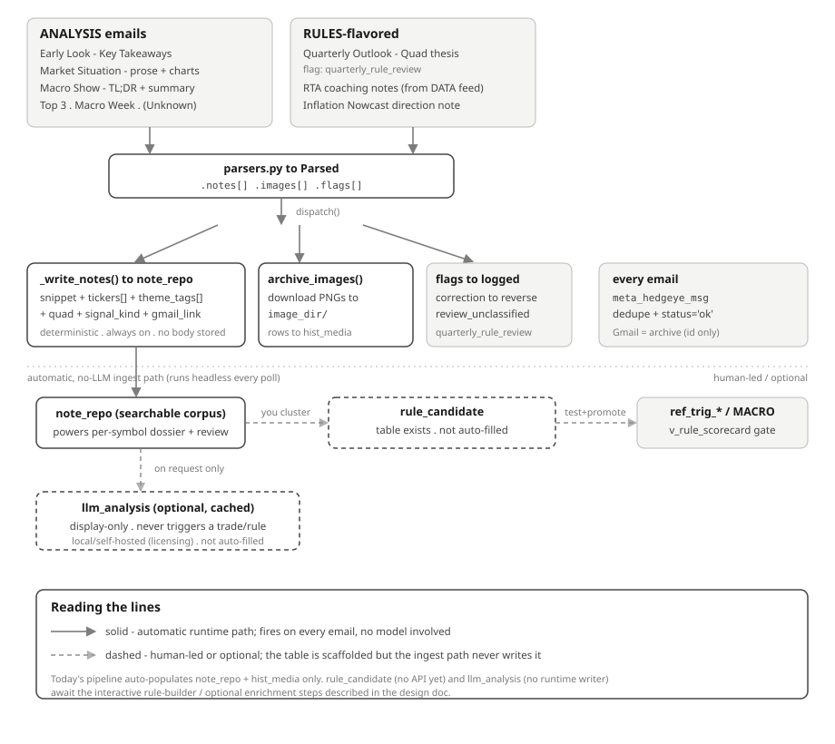

# Hedgeye Email — Data-Loading Dataflow

How a Hedgeye email becomes rows in `hist_*` (and notes/images), end to end.
Companion to the design doc `docs/hedgeye_feeds_design.md`; this one is the **as-built**
loading reference. Code: `etl/hedgeye_fetch.py`, `etl/hedgeye/{source,classify,parsers,emit,dispatch}.py`.

Added 2026-06-27 (commit `c11b48a`, TASK_93–101).

---

## 1. The pipeline (load path)



Stage by stage:

1. **Poll** — `etl/hedgeye_fetch.py` is a headless poller (modeled on `etl/fetch_macro.py`).
   Opens a read-only IMAP connection (`etl/hedgeye/source.py::ImapSource`), pulls messages
   `FROM hedgeye.com` from the last 2 days, yields `Email` objects. Runs on a timer,
   independent of Cowork. `gmail_api` provider is a stub.
2. **Classify** — `classify()` matches each email deterministically (no LLM) on subject
   regex + header banner image asset + meta tag → a destination `DATA | ANALYSIS | RULES |
   DROP | UNKNOWN`. Marketing sender and "Access Here" emails are dropped.
3. **Dedupe** — `already_processed()` checks the `meta_hedgeye_msg` ledger by `message_id`.
   Seen → skip. (Same role `meta_file_processed` plays for files.)
4. **Parse** — `parser_for(et)` runs the matching pure function in `parsers.py`, producing a
   `Parsed` object: `.tables` (rows → `hist_*`), `.notes`, `.images`, `.flags`, `.warnings`.
5. **Dispatch** — `dispatch()` routes each table to one of two lanes, writes notes/images,
   handles correction reversal, and records the ledger with `status='ok'`.
6. **Converge** — both lanes land rows in `hist_*` → `derive_all(D)` (idempotent) → `drv_*`
   → `drv_actionable` → dashboard.

### The two load lanes

The lane is decided purely by membership in `emit.FILE_LANES`.

| | Lane A — FILE | Lane B — DIRECT |
|---|---|---|
| Feeds | risk_range, investing_ideas, etf_changes, portfolio_solutions, the_call | real_time_alert, the_call top-5, macro stance, inflation nowcast, signal strength |
| Mechanism | `emit.write_feed()` renders a file into the watched `source_dir` | `insert_skip_duplicates()` straight into the table |
| Files generated | `RR …xlsx`, `IIChange …xlsx`, `ETFChange …xlsx`, `PS …xlsx`, `call …csv` | none |
| Then loaded by | existing `scheduler → etl_load → HIST_MAPS` | — |
| Triggers derive | scheduler does it after pickup | `_trigger_derive()` fires explicitly |
| Tables | `hist_rr`, `hist_iichg`, `hist_etfchg`, `hist_ps`, `hist_call` | `hist_rta`, `hist_call_top5`, `hist_hedgeye_stance`, `hist_macro`, `hist_sss_change` |

**Why two lanes:** five feeds already had a hand-loaded file format and an existing
loader/mapping, so their parsed rows are re-rendered *back into that file format* and dropped
in the watched folder — your existing `scheduler → etl_load → derive` does the actual load,
zero new code. The genuinely new tables have no file format, so they insert directly.

Two file-lane guards: rendering is **skipped if a real file for that feed+date already
exists** (`_file_exists_for_date` — real files win), and the path is pre-registered in
`meta_file_origin` so the loader stamps `source_kind='email'`.

---

## 2. Two worked examples (one per lane)



**Risk Range (file lane).** Keys off `SYMBOL (OUTLOOK)` lines, then takes the *last 3
numbers* on the next line as BUY/SELL/PREV — robust even when the description contains digits
(`S&P 500`). Also sweeps the `#OUTBUCKET` roster (emitting those with zero prices). ~38 rows →
`hist_rr` → rendered as `RR YYYY-MM-DD.xlsx` (sheet `Table_Section`) → existing `load_rr`.

**Real-Time Alert (direct lane).** The most trade-relevant feed: action/side/symbol/price from
the headline, three duration booleans from the `Durations` line, coaching notes into both
`hist_rta` and a `note_repo` row. A **correction** email (`"fat finger"`, `"disregard"`, …)
writes no trade — it flags `correction`, and dispatch flips `superseded=TRUE` on the prior
open alert for that ticker. Direct insert into `hist_rta`, then explicit `_trigger_derive()`.

---

## 3. ANALYSIS / RULES side (thin by design)



- **Automatic (no-LLM, every poll):** parsers emit `.notes` and `.images`; `dispatch` writes
  `note_repo` (snippet + tickers + theme tags + quad + Gmail link — never the raw body) and
  downloads chart PNGs into the configured `image_dir`, logging them in `hist_media`. That is
  the entire automatic footprint of this side.
- **Flags** are produced but lightly consumed: `correction` drives auto-reverse;
  `quarterly_rule_review` and `review_unclassified` are recorded/logged, not acted on.
- **Scaffolded but NOT wired:** `rule_candidate` and `llm_analysis` tables exist in
  `db/baseline.sql`, but nothing in the ingest path writes them, and there are no API
  endpoints for `rule_candidate` yet. They are placeholders for the *interactive* rule-builder
  (cluster notes → draft predicate → test vs `v_rule_scorecard` → promote into `ref_trig_*`)
  and the *optional, on-request* LLM enrichment (kept local/self-hosted — Hedgeye's ToS
  forbids forwarding the research).

Design intent: quantitative / explicit-action feeds become DATA that can auto-drive the
engine; qualitative feeds become tagged notes you approve — keeping you in control of
permanent rules.

---

## 4. Cross-cutting invariants

- **Idempotency, two levels:** `meta_hedgeye_msg` ledger (per email) + `ON CONFLICT DO
  NOTHING` (per row).
- **Gmail is the archive:** only `message_id` is stored locally; a fixed parser can backfill
  by re-fetching (`python -m etl.hedgeye_fetch --backfill YYYY-MM-DD`).
- **No DB in the sandbox:** `dispatch` performs DB writes, so it runs only where Postgres is
  reachable (app host / developer + tester agents), never inside Cowork.

## 5. Run

```cmd
python -m etl.hedgeye_fetch --once                 :: one pass, then exit
python -m etl.hedgeye_fetch --loop                 :: poll forever
python -m etl.hedgeye_fetch --backfill 2026-06-01  :: reprocess from a date (re-fetch by id)
python -m etl.hedgeye_fetch --dry-run              :: classify only, no DB writes
```

## 6. Tables touched

| Table | Lane / writer | Notes |
|---|---|---|
| `hist_rr` | FILE (`RR .xlsx` → load_rr) | full ~38-row signal table + OutBucket roster |
| `hist_iichg` | FILE (`IIChange .xlsx`) | Investing Ideas add/remove events |
| `hist_etfchg` | FILE (`ETFChange .xlsx`) | ETF Pro add/remove (no ranges) |
| `hist_ps` | FILE (`PS .xlsx`) | Portfolio Solutions full re-rank table (from HTML) |
| `hist_call` | FILE (`call .csv`) | The Call HEDGEYE POSITIONS (long/short/neutral) |
| `hist_rta` | DIRECT | Real-Time Alerts; corrections auto-reverse prior alert |
| `hist_call_top5` | DIRECT | The Call — Top 5 Most Actionable Ideas |
| `hist_hedgeye_stance` | DIRECT | Macro Show daily Bullish/Bearish stance |
| `hist_macro` | DIRECT | Inflation Nowcast (`HE_CPI_NOWCAST` series) |
| `hist_sss_change` | DIRECT | Signal Strength delta events |
| `note_repo` | AUTO (analysis) | snippets + tags + Gmail link; powers dossier |
| `hist_media` | AUTO (analysis) | archived chart PNGs |
| `meta_hedgeye_msg` | every email | idempotency ledger |
| `rule_candidate`, `llm_analysis` | — | tables exist, not auto-populated |
