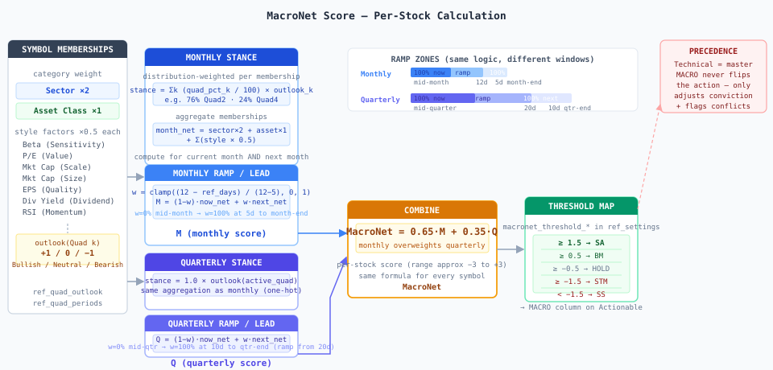

# Quad regime → MACRO — design

How the macro **quad regime** becomes a single **MACRO** signal per stock on the
Actionable screen. Authoritative design + implementation reference.

**Key tables:** `ref_quad_periods` (period distributions), `ref_quad_outlook`
(Bullish/Bearish/Neutral per category × quad), `drv_macro_score` (output).
**Deriver:** `etl/derive_macro.py` → wired into `derive_all()` after `drv_ma`.

---

## Principles

1. **Overlay, not standalone.** MACRO decides when to press a bottom-up call and
   when to back off — never a buy/sell on its own.
2. **Technical is master.** MACRO never flips the action; it adjusts conviction and
   flags conflicts. It may lean the call only when Technical is neutral/absent.
3. **One `MACRO` column** in SA/BM/HOLD/STM/SS vocabulary + `actionDisplay()` colors.
4. **One regime band** (Month | Quarter | Favoring + breadth + action split) above the grid.
5. **Both horizons use identical per-stock calculation** — same membership aggregation,
   same ramp/lead logic; only the input weights differ (distribution vs one-hot).
6. All weights/windows/thresholds live in `ref_settings`, tunable against outcomes.

---

## Data model

**`ref_quad_periods`** — one row per month and one per quarter:

| Column | Monthly rows | Quarterly rows |
|---|---|---|
| `period_type` | `'month'` | `'quarter'` |
| `quad` | argmax of distribution | fixed top-level quad |
| `quad1_pct … quad4_pct` | probability weights (sum ≈ 100) | NULL (one-hot implied) |
| `start_date / end_date` | month boundary | quarter boundary |

Seeded from `db/seeds_quad_periods.sql`. If HQds tab gains a pct column,
`etl/load_raw.py::load_hqds` can populate it instead.

**`ref_quad_outlook`** — unchanged, already exists:
`(category, sub_category)` × `quad1..quad4` = Bullish / Neutral / Bearish.
Categories in use: `Equity Sectors`, `Asset Class`, `Equity Style`.

**`drv_macro_score`** — output table (idempotent DELETE+INSERT per derive date):
`as_of_date, tos_symbol, monthly_score, qtr_now_net, quarterly_score, macronet,
macro_action, monthly_scores_json, detail`.
`monthly_score` is `M_window` (TASK_126, sliding look-ahead window — see Stage 3).
`month_now_net` / `month_next_net` / `month_weight` / `qtr_next_net` / `qtr_weight`
are **deprecated** — kept as columns for backward compat, no longer populated
(NULL). `qtr_now_net` == `quarterly_score` (quarterly leg is a plain
current-quarter one-hot, no next-quarter blend — see Stage 3). `detail` JSONB
carries the window breakdown (months/eff/near-far/tracking) that used to be
recomputed live in `api/routers/dash.py` — see §Stage 3 detail shape below.

---

## Pipeline



---

## Stage 1–2 — per-stock membership net score

A symbol is a **bundle of memberships**, each `(category, sub_category, weight)`:

| Membership | Category | Weight | Source |
|---|---|---|---|
| Sector | `Equity Sectors` | **×2** | `drv_ma.sector` |
| Asset class | `Asset Class` | **×1** | `drv_ma.asset_class` |
| Style factors | `Equity Style` | **×0.5 each** | classified from fundamentals |

**Style classification thresholds** (in `etl/derive_macro.py::_classify_style`):

| Style tag | Condition |
|---|---|
| High Beta | `beta ≥ 1.5` |
| Low Beta | `beta ≤ 0.7` |
| Defensives | sector ∈ Consumer Staples, Health Care, Utilities, Real Estate |
| Cyclical | sector ∈ Industrials, Materials, Energy, Consumer Discretionary, Financials |
| Value | `0 < P/E ≤ 15` |
| Secular | `P/E > 30` |
| Dividend | `div_yield > 2%` |
| Momentum | `RSI > 65` |
| Small Caps | `market_cap < $2B` |
| Mid Caps | `$2B ≤ market_cap < $10B` |

For each membership, stance against a quad distribution:
```
stance = Σ_k  (quad_k_pct / 100) × outlook(quad_k)     +1 / 0 / −1
```

Aggregate:
```
net = sector×2 + asset_class×1 + Σ(style×0.5)
```

---

## Stage 3 — sliding look-ahead window (TASK_126, 2026-07-15)

**Replaces** the old month now/next ramp + quarterly one-hot blend. Each day,
a sliding window `[D, D+H)` (`H` = `quad_lookahead_days`, default 60 calendar
days) is projected onto `ref_quad_periods`' monthly rows. Overlap-day
fractions (optionally decayed) give one normalized weight per month; those
weights blend the months' own quad distributions into **one effective
distribution**, which feeds the *unchanged* Stage 1–2 membership calc.
"Days passed in month" is now inherent to the window sliding one day at a
time — the old ramp params (`quad_month_ramp_begin_days`,
`quad_month_lead_days`, `quad_qtr_ramp_begin_days`, `quad_qtr_lead_days`) are
retired (reads deleted from `etl/derive_macro.py`; rows left harmless in
`ref_settings` for audit/rollback).

```
window = [D, D+H)                                   H = quad_lookahead_days (60)
for each monthly row m overlapping window:
    w_m = overlap_days(m, window) / H                (optionally decayed — see below)
normalize Σ w_m = 1
eff_quad_k = Σ_m  w_m × quad_k_pct(m)                 k = 1..4 → one distribution
M_window   = Σ_m  w_m × stance(m)                     stance(m) = Stage 1-2 net vs month m's own distribution
```

- **Decay** (optional, default off): `quad_lookahead_decay_hl` — half-life in
  days; weights each day in the overlap by `0.5^(days_from_D / hl)` before
  summing. `hl = 0` = flat window (no decay).
- **Coverage fallback**: if `ref_quad_periods` doesn't extend through the
  window end, the window truncates to the months it has (`coverage_pct` =
  the covered day-weight mass / the window's full day-weight mass). Coverage
  < 50% → fall back to a current-month one-hot and flag `fallback: true`.
- Pure function: `etl/derive_macro.py::window_weights(d, months, h, decay_hl)`
  → `(weighted, coverage_pct)`, unit-tested in `tests/test_quad_window.py`
  (month-boundary overlap, mid-month slide, decay, truncation/coverage).

**Worked example** (mid-July anchor, H=60, no decay — matches the SPY row on
2026-07-14): window = Jul 14 → Sep 12. July contributes 18 remaining days
(30%), August the full month (52%), September the first 12 days (18%) — the
weights literally slide day-by-day as D advances, no discrete ramp step.

**Quarterly leg** (`Qtr`) is unchanged mechanically (same Stage 1–2 one-hot
membership calc against the current quarter's declared quad) but simplifies
to **current quarter only, no next-quarter blend** — its own ramp/lead params
are retired for the same reason as the monthly ones.

### Near/far split + tracking tag

Per-month stances above also give, for the window:

- **near** = the nearest month's own stance; **far** = the weight-renormalized
  average stance of the rest of the window (`None` if the window has only one
  month). Feeds the Stage 4 sign-agreement override (redefined on near/far,
  not month/quarter).
- **tracking tag**: the symbol's current technical direction — `sign(last_price
  − sma_50)` (simplest existing trend field already on `drv_ma` at this point
  in the derive cascade; `drv_actionable`/`trig_action` don't exist yet here)
  — is compared to each window month's stance sign, nearest-first. First
  month whose sign matches → `tracking = "2026-08 (Quad 1)"`. No match (or a
  neutral technical direction) → `tracking = null`, UI shows "fighting the
  quad path".

### Combine

```
MacroNet = (1 − q) × M_window  +  q × Qtr        q = quad_horizon_weight_qtr, default 0.05
```

Quarterly is minimized (was 0.35 → 0.20 on 2026-07-06 → **0.05** on
2026-07-15/TASK_126) — the sliding window now carries essentially all of the
forward-looking signal; the quarterly leg is a small stabilizer.
`quad_horizon_weight_mo` is retired as a separate setting — the monthly/window
weight is implicitly `1 − q`.

### `detail` JSONB (drv_macro_score.detail — also the tooltip source)

```json
{"h": 60, "coverage_pct": 100, "fallback": false,
 "months": [{"m":"2026-07","quad":3,"w":0.18,"stance":-1.2},
            {"m":"2026-08","quad":1,"w":0.52,"stance":2.1},
            {"m":"2026-09","quad":1,"w":0.30,"stance":2.1}],
 "eff": {"q1":58,"q2":10,"q3":27,"q4":5},
 "near_vs_far": {"near":-1.2,"far":2.1,"override":"none"},
 "tracking": "2026-08 (Quad 1)"}
```

---

## Stage 4 — threshold map → action

`MacroNet` is mapped to the standard action vocabulary via `ref_settings` keys
(`macro_thr_*`; legacy `macronet_threshold_*` names still work as a fallback):

| Key | Current value | Action |
|---|---|---|
| `macro_thr_bm` | 1.25 | MacroNet ≥ → **BM** |
| `macro_thr_bs` | 1.05 | MacroNet ≥ → **BS** |
| `macro_thr_stm` | −0.15 | MacroNet ≤ → **STM** |
| `macro_thr_sa` | −0.6 | MacroNet ≤ → **SA** |

Recalibrated 2026-07-15 (TASK_126) by percentile against the live
`drv_macro_score` output after the window switch (same method as
2026-07-06; target ~3% BM, ~12% BS, ~70% HOLD, ~12% STM, ~3% SA). The
near/far sign-agreement override puts a structural floor under SA (~6.9% on
the live universe — any symbol whose nearest + weighted-rest both go
negative is forced to SA regardless of the raw score threshold, same
asymmetric-by-design rule as before). Live split achieved at these values:
BM 2.4% / BS 17.3% / HOLD 65.0% / STM 8.3% / SA 6.9% (n=1152,
2026-07-14) — re-check after any change to `quad_horizon_weight_qtr` or the
window params, since re-weighting shifts the whole distribution (see
`etl/derive_macro.py::to_action` / `api/routers/dash.py::_macronet_to_vocab`).

**Sign-agreement override (2026-07-06 rule, redefined on the window by
TASK_126, asymmetric by design):** when `near` and `far` (Stage 3) agree on
direction, the result never lands in HOLD:

- **Both positive** → floored to BS, still reaching BM if the blend clears
  `macro_thr_bm` (score-driven, same as the disagreement case below).
- **Both negative** → always **SA**, regardless of magnitude. Any negative
  agreement between the near month and the rest of the window is treated as
  a full sell signal — deliberately not scaled down to STM even when both
  components are only mildly negative. This is an intentional asymmetry
  (confirmed with the user 2026-07-06): the buy side stays score-gated, the
  sell side does not.

HOLD stays reachable only when near/far disagree, when `far` is `None`
(single-month window), or when a component is exactly zero.

---

## Stage 5 — precedence: Technical is master

MACRO is an overlay — it never overrides the Technical action.

| Bottom-up ↓ \ Macro → | Bullish | Neutral | Bearish |
|---|---|---|---|
| **Buy** | PRESS LONG | Long | **CONFLICT — trim/skip** |
| **Neutral** | Watch-long | — | Watch-short |
| **Sell** | Dip — don't short | Short | PRESS short / exit |

---

## Stage 6 — presentation

- **MACRO column** on Actionable grid: shows `macro_action` badge + raw `macronet`
  score in small faded label (e.g. `BM 1.88`). Rendered by `macroCellHtml()` in
  `web/actionable.js`. Sortable via `data-key="macro_value"`. `macro_conf`
  (badge opacity fade) is now the nearest window month's weight (TASK_126);
  `macro_turn` (ramp-proximity alert) is retired — the sliding window is
  continuous, so there's no discrete "turn" event left to flag.
- **Regime band** (`#macroBand`): Window mix + dominant forward quad (was
  Month) | Quarter (minimized, de-emphasized) | Favoring | ↑↓ breadth | action
  split. Loaded by `loadMacroBand()` in `web/actionable.js`, aggregate
  (symbol-independent) window mix from `GET /api/quad-window`.
- **Tooltip** on MACRO cell (`_macroTooltip()` / `_buildMacroPopHtml()` in
  `web/actionable.js`, lazy-loaded via `GET /api/actionable/macro-detail`,
  which layers `drv_macro_score.detail` — the window breakdown — onto the
  Stage 1–2 membership resolution that's still computed live): "How to act"
  directive, **Window** (per-month table: month, quad, weight, stance;
  effective blended mix; tracking tag / "fighting the quad path"), Category
  Drivers (nearest-month outlook per membership), Quarter (locked-in quad +
  score, minimized), and the `MacroNet = a×Qtr + b×M_window = ... → vocab`
  formula line.

---

## Tunable params (`ref_settings`)

| Key | Default | Meaning |
|---|---|---|
| `quad_lookahead_days` | 60 | look-ahead window H, calendar days |
| `quad_lookahead_decay_hl` | 0 | within-window day-weight decay half-life; 0 = flat/off |
| `quad_horizon_weight_qtr` | 0.05 | Quarterly weight `q` in MacroNet = (1−q)·M_window + q·Qtr |
| `macro_thr_bm` | 1.25 | MacroNet ≥ → BM |
| `macro_thr_bs` | 1.05 | MacroNet ≥ → BS |
| `macro_thr_stm` | −0.15 | MacroNet ≤ → STM |
| `macro_thr_sa` | −0.6 | MacroNet ≤ → SA |

Retired (TASK_126, rows left in `ref_settings`, no longer read):
`quad_month_ramp_begin_days`, `quad_month_lead_days`,
`quad_qtr_ramp_begin_days`, `quad_qtr_lead_days`, `quad_horizon_weight_mo`.

Stance map: Bullish +1 · Neutral 0 · Bearish −1.

---

## Implementation files

| File | Role |
|---|---|
| `etl/derive_macro.py` | Per-symbol MacroNet deriver; `window_weights()`/`build_effective_distribution()`/`near_far_split()`/`tracking_tag()`/`to_action()` pure functions (TASK_126); writes `drv_macro_score` |
| `etl/derive.py::derive_all` | Wires in `_derive_macro_impl` after `drv_ma` |
| `db/baseline.sql` | `drv_macro_score` table + index + `detail` JSONB column (TASK_126) |
| `db/seeds_quad_periods.sql` | Seeds monthly quad distributions (covers the look-ahead window) |
| `api/routers/dash.py` | LEFT JOINs `drv_macro_score`; grid row prefers it over API-time calc; `GET /api/actionable/macro-detail` layers `drv_macro_score.detail` onto the still-live Stage 1–2 membership resolution; `GET /api/quad-window` (TASK_126) serves the aggregate window mix for the regime band |
| `web/actionable.js` | `macroCellHtml()` renders MACRO column; `loadMacroBand()` for band (now window-based); `_macroTooltip()`/`_buildMacroPopHtml()` render the window breakdown |
| `tests/test_quad_window.py` | Pure-Python unit tests for the window functions (TASK_126) |
| `docs/diagrams/macronet_formula.svg` | Full pipeline visualization (pre-TASK_126 ramp version — not yet redrawn for the window) |
