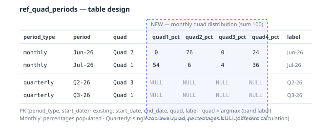
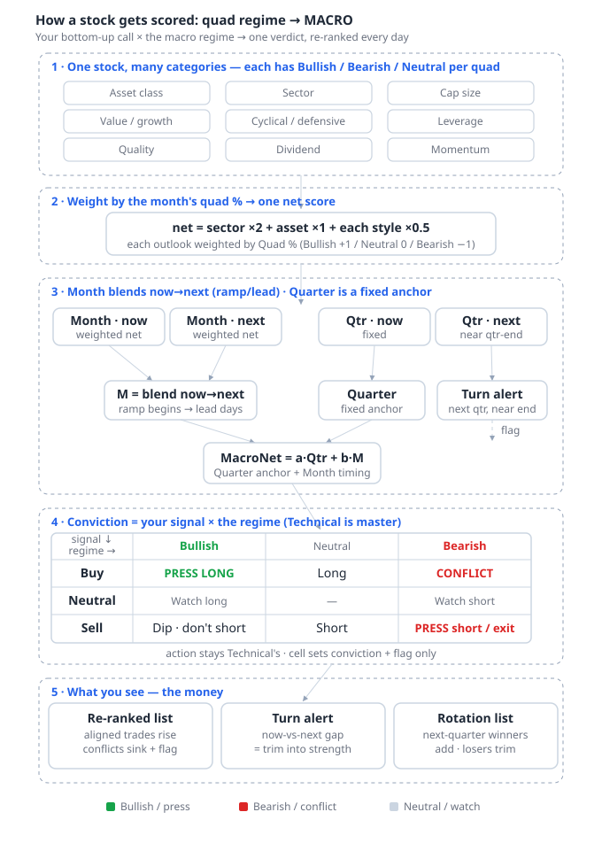
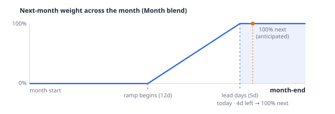
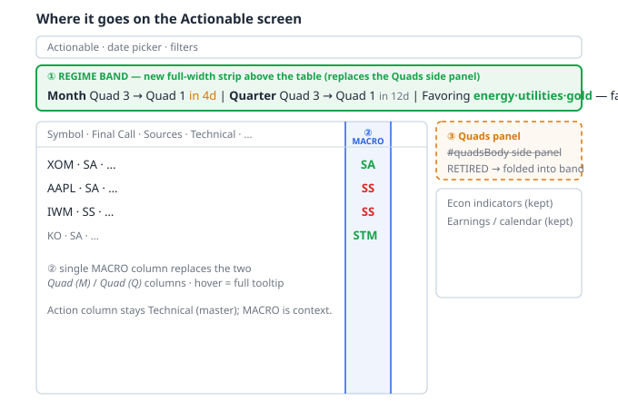
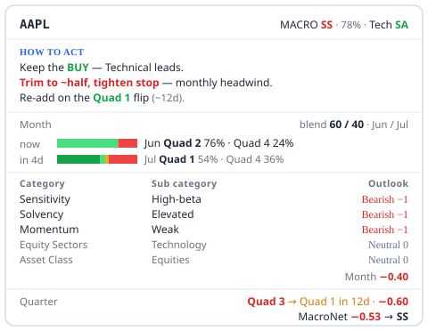

# Quad regime → MACRO — design

How the macro **quad regime** becomes a single, money-making **MACRO** signal per stock on
the Actionable screen. Authoritative design doc; implementation spec is
`agent-tasks/TASK_74_quad_macro_overlay.md`.

Outlook source: `ref_quad_outlook.quad1..quad4` **text as-is** — values are
**Bullish / Bearish / Neutral**, mapped to **+1 / 0 / −1**. Active regime + monthly
distribution: `ref_quad_periods`.

---

## Settled decisions

1. **Overlay, not a standalone signal.** The quad decides when to press a bottom-up call
   and when to back off — never a buy/sell on its own.
2. **Sources / Technical is the master (precedence).** The quad **never** flips the action;
   it only adjusts conviction and raises flags. It may *lean* the call only when Technical
   is neutral/absent (low confidence).
3. **One `MACRO` column** in the app's existing action vocabulary (SA / STM / SS / BM …) and
   `actionDisplay()` colors. Replaces the two decorative `Quad (M)` / `Quad (Q)` columns.
4. **One regime band** (Month | Quarter | Favoring) above the table. **The `Quads` side
   panel (`#quadsBody`) is retired** and folded into the band.
5. **Monthly is a weighted distribution; quarterly is a fixed top-level anchor.** Different
   calculations (see Stage 3).
6. **MacroNet is fixed / presentation-independent.** Precedence + vocabulary mapping are
   applied at consumption only.
7. All weights/windows/thresholds live in `ref_settings`, tunable against outcomes.

---

## Data model — capture the monthly quad distribution

The "U.S. Monthly Quad Forecast" gives, for **each month**, a probability **distribution**
across the four quads (e.g. Jun = 76% Quad 2 / 24% Quad 4). That distribution is **not in
the DB today** — capturing it is the schema change.

**`ref_quad_periods`** — add the four monthly weights:

```sql
ALTER TABLE ref_quad_periods
  ADD COLUMN IF NOT EXISTS quad1_pct NUMERIC,
  ADD COLUMN IF NOT EXISTS quad2_pct NUMERIC,
  ADD COLUMN IF NOT EXISTS quad3_pct NUMERIC,
  ADD COLUMN IF NOT EXISTS quad4_pct NUMERIC;
```

- **Monthly rows:** `quad1_pct..quad4_pct` populated from the HQds forecast (sum ≈ 100).
  `quad` stays as the **argmax** (dominant quad) for the band label.
- **Quarterly rows:** keep the single top-level `quad`; the `quad*_pct` columns stay **NULL**
  (quarterly carries no distribution — see Stage 3).
- Data source: the distribution is supplied as **`db/seeds_quad_periods.sql`** (captured
  from the forecast chart, user-confirmed) — it UPSERTs `quad1_pct..quad4_pct` onto the
  monthly rows. If the percentages are later added to the HQds tab,
  `etl/load_raw.py::load_hqds` can populate them instead.



`ref_quad_outlook` (Bullish/Bearish/Neutral per `category, sub_category` × quad1..4) is
unchanged — it already exists.

---

## Pipeline



---

## Stage 1–2 — one stock, many categories → net score (monthly)

A symbol is a **bundle of memberships**, each a `(category, sub_category)` row in
`ref_quad_outlook` with its own Bullish/Bearish/Neutral per quad.

| Membership | Source for the symbol |
|---|---|
| Asset class | `drv_*.asset_class` |
| Sector (equities) | `drv_ma.sector` / `equity_sector` |
| Scale / Value / Sensitivity / Solvency / Quality / Dividend / Momentum (style) | `drv_fundamentals.market_cap / pe_ratio / beta / fcf_per_share / eps / div_yield`, `rsi` |

For a **month**, each membership's stance is the quad-distribution-weighted blend of its
four outlooks:

```
membership_stance(month) = Σ_k  (quadk_pct/100) · stance(Quad k text)     stance: Bullish +1 / Neutral 0 / Bearish −1
```

Then aggregate memberships (top-line dominates, style tilts):

```
month_net = sector×2 + asset_class×1 + Σ(each style ×0.5)
```

Conflicts (top-line vs style disagree) are flagged. Confidence = `max(quadk_pct)` (or
`1 − entropy`) of the month's distribution — damps the lean on ambiguous months.

---

## Stage 3 — monthly blend (ramp/lead) + fixed quarterly anchor → MacroNet

**The two horizons are calculated differently — this asymmetry is deliberate.**

### Monthly = dynamic, tactical (weighted + anticipatory blend)

Compute `month_net` for **this month** and **next month** (Stage 1–2). Blend them by an
**anticipation lead** — the market prices next month's econ *before* month-end, so the
next-month weight reaches **100% a set number of days before the boundary** and holds:

```
ref_days   = trading days to month-end
next_weight = clamp( (ramp_begin − ref_days) / (ramp_begin − lead_days), 0, 1 )
M = (1 − next_weight)·month_now_net + next_weight·month_next_net
```

Three zones: `ref_days > ramp_begin` → next 0% (100% this month); between → linear ramp;
`ref_days ≤ lead_days` → next **100%** (fully anticipating next month). Two tunables:
**`ramp_begin`** and **`lead_days`**.



### Quarterly = same calculation as monthly, one-hot weight

Uses **identical Stage 1–2 logic** (same memberships, same aggregation weights) — the only
difference is the input distribution: the active quarter's quad gets **100% weight**, all
others **0%**:

```
quarterly_stance(membership) = 1.0 × outlook(active_quad)     ← one-hot vs monthly's distribution
Q = sector×2 + asset_class×1 + Σ(each style ×0.5)            ← same aggregation as monthly
```

This means a Tech stock and a Utilities stock get **different Q values** within the same
quarter. Q is constant for the quarter (no ramp/lead, no blending), stepping only at the
quarter boundary. Near quarter-end the **next quarter** is surfaced as a discrete turn alert
— it does **not** blend into `Q`.

### Combine

```
MacroNet = b·M + a·Q       b > a   (Month = primary signal — probability-weighted + ramp; Quarter = same-calc strategic anchor at lower weight)
```

`MacroNet` → SA/STM/SS/BM via a threshold map. The turn signal feeds from the monthly
current-vs-next divergence (continuous) and the late-quarter next-quarter alert (discrete).

---

## Stage 4 — precedence: Technical is master

`MacroNet` × the bottom-up direction yields a **conviction + flag**, never an action. The
**Action column always equals the Technical signal**; the quad only moves conviction and
raises the flag (and may lean the call when Technical is neutral, at low confidence).

| Bottom-up ↓ \ Macro → | Bullish | Neutral | Bearish |
|---|---|---|---|
| **Buy**  | PRESS LONG | Long | **CONFLICT — trim/skip** |
| **Neutral** | Watch-long | — | Watch-short |
| **Sell** | Dip — don't short | Short | PRESS short / exit |

---

## Stage 5 — presentation

### Placement




- **Regime band (new):** one thin full-width line above `#actGrid` — **on the same line:**
  Month (now → next), Quarter (now, → next quad **only near quarter-end**), then the active
  **monthly** quad's **Bullish** (green) and **Bearish** (red) factor lists, market-wide
  (the style/sector `sub_category` values in `ref_quad_outlook` favored/unfavored under the
  active monthly quad, weighted by the month's quad %). **Each factor carries a quarterly
  direction arrow** — green ↑ (quarterly bullish) / red ↓ (quarterly bearish), read from
  `ref_quad_outlook` under the **quarterly** quad — so month‑vs‑quarter divergence is
  visible per factor (e.g. `High‑Beta ↓` = bullish this month, quarter turning against it).
  Display‑only; the quarterly MacroNet term stays top‑level. Lists trimmed to fit; full set
  on hover. Reuses `/api/dashboard/quads` (+ a small factor-list helper).
- **`MACRO` column:** replaces `Quad (M)` / `Quad (Q)` near `Act`. Renders in SA/STM
  vocabulary + a confidence cue + a graded turn arrow (`↘ Quad 4 45%↑`). Same words/colors
  as the Technical column, so a conflict is obvious at a glance.
- **Retire** the `Quads` side panel (`#quadsBody` `<section>` + its JS).

### The MACRO tooltip



Leads with **How to act**, then the evidence — no data-model narration:

- **How to act** — precedence ("keep the BUY"), confidence-scaled sizing ("trim to ~half"),
  monthly-tactical vs quarterly-strategic wording, and a turn watch.
- **Month** — the now/next distributions (`Quad 2 76% · Quad 4 24%`) with the
  `blend 60 / 40` weight from ramp/lead; **Category / Sub category / Outlook**
  (Bullish/Bearish/Neutral, +1/0/−1) drivers read straight from `ref_quad_outlook`; the
  blended `Month` value.
- **Quarter** — `Quad 3` (and `→ Quad 1 in 12d` only near quarter-end) + its value.
- **MacroNet** → SA/STM/SS/BM.

"Quad N" = the regime number; **Month** / **Quarter** = the horizons (never the bare "Q").

---

## Tunable params (`ref_settings`)

| Key | Default | Meaning |
|---|---|---|
| `quad_month_ramp_begin_days` | 12 | days before month-end the next-month weight starts ramping |
| `quad_month_lead_days` | 5 | days before month-end the next-month weight hits 100% |
| `quad_horizon_weight_qtr` | 0.35 | Quarter weight `a` in MacroNet |
| `quad_horizon_weight_mo` | 0.65 | Month weight `b` in MacroNet |
| `quad_category_weight_*` | sector 2, asset 1, style 0.5 | category aggregation weights |
| `macronet_threshold_*` | TBD | MacroNet → SA/STM/SS/BM cutoffs (confirm vs `actionDisplay()` vocab) |

Stance map: Bullish +1 · Neutral 0 · Bearish −1.

---

## Build sequence

`agent-tasks/TASK_74_quad_macro_overlay.md`, phased:

1. **Join fix + period truth + monthly-weight schema** — verify/correct the symbol→quad
   join; add `q1_pct..q4_pct`; load monthly distribution; resolver returns current + next +
   ref_days per horizon.
2. **Style-factor classification** — per-symbol style memberships from fundamentals.
3. **MacroNet backend** — distribution-weighted monthly stance (one-hot until weights land)
   → ramp/lead blend `M` + fixed top-level `Q` → MacroNet + turn flag → SA/STM mapping.
4. **Presentation** — single `MACRO` column + tooltip; regime band; **retire the Quads
   side panel**.

Follow-on: `agent-tasks/TASK_75_quad_rotation_shortlist.md` — the Stage-5 rotate-in /
rotate-out lists + sortable MACRO column (build after TASK_74).
